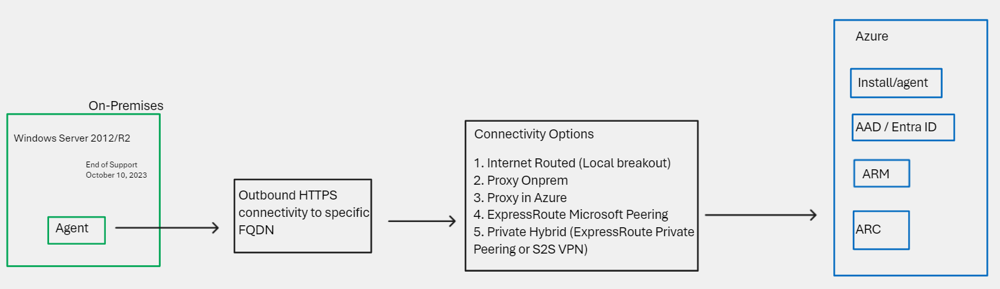
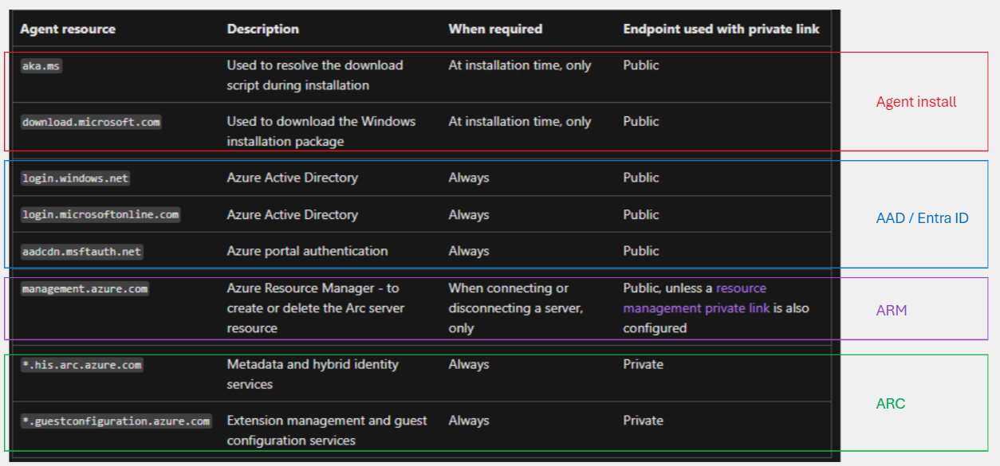
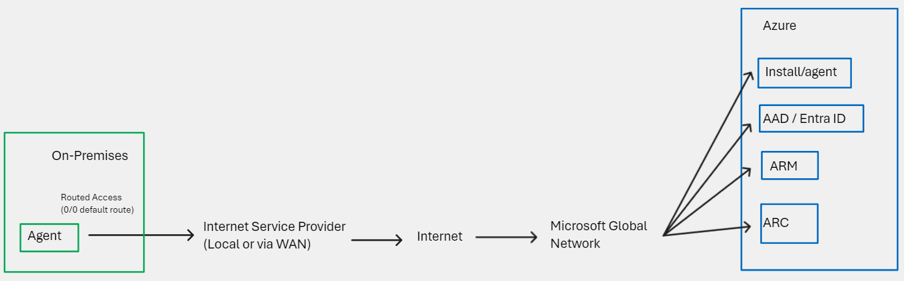
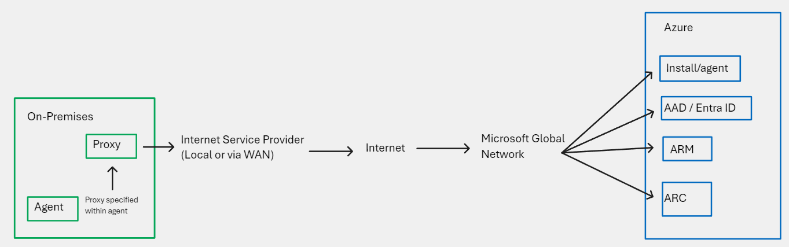
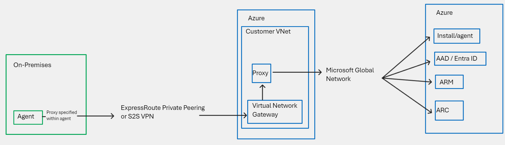
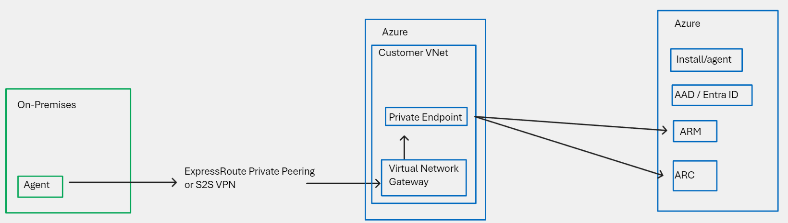
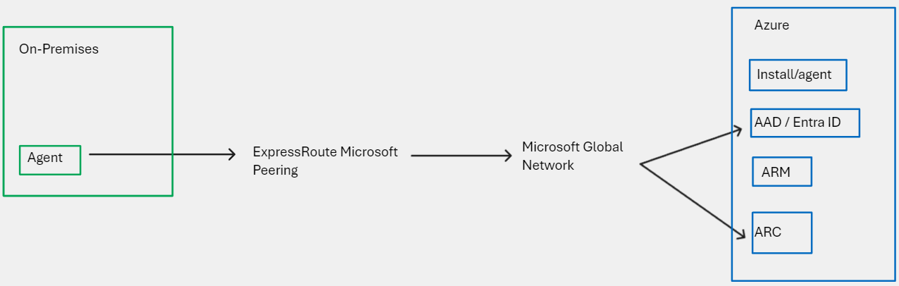

# Azure ARC ESU Network Considerations

_This article is co-authored by Microsoft colleagues Cynthia Treger, Carl Syner and Joachim Gomard._

<!-- TOC -->

- [Azure ARC ESU Network Considerations](#azure-arc-esu-network-considerations)
- [Context](#context)
- [Introduction](#introduction)
- [Endpoint requirements](#endpoint-requirements)
    - [Agent install](#span-stylecolorredagent-installspan)
    - [AAD / Entra ID](#span-stylecolorblueaad--entra-idspan)
    - [Azure Resource Manager (ARM)](#span-stylecolorpurpleazure-resource-manager-armspan)
    - [Azure ARC](#span-stylecolorgreenazure-arcspan)
- [Connectivity options](#connectivity-options)
    - [Internet Routed (Local breakout)](#internet-routed-local-breakout)
    - [Proxy Onprem](#proxy-onprem)
    - [Proxy in Azure](#proxy-in-azure)
    - [Private Hybrid (ExpressRoute Private Peering or S2S VPN)](#private-hybrid-expressroute-private-peering-or-s2s-vpn)
    - [ExpressRoute Microsoft Peering](#expressroute-microsoft-peering)
- [Summary](#summary)

<!-- /TOC -->

# Context

Please see overviews provided elsewhere, [example](https://techcommunity.microsoft.com/t5/azure-arc-blog/generally-available-windows-server-2012-and-2012-r2-extended/ba-p/3930712), but in short, there is increased focus on ARC-enabling On-Premises resources at the time of writing, and this in turn drives discussion on networking requirements for the Connected Machine agent.

# Introduction
The main output of this article, it to map the possible connectivity methods to Azure Endpoints that the agent communicates with. (Not all endpoints can leverage all methods). We will also discuss the pros/cons of each connectivity method, and why a customer may use one over another.

# Endpoint requirements

The reduced list of endpoints required for ESU is maintained on the official Azure docs site [here](https://learn.microsoft.com/en-us/azure/azure-arc/servers/network-requirements?tabs=azure-cloud#subset-of-endpoints-for-esu-only). I have copied the table below, and highlighted the different categories.

## Agent install

Pull agent install files down over Internet from Microsoft Download centre (via proxy or not), orchestrated manually or at [scale](https://learn.microsoft.com/en-us/azure/azure-arc/servers/deployment-options#onboarding-methods). 

## AAD / Entra ID

Authentication/authorization provided by Entra ID. Almost defiantly already in place within your network if working with other Microsoft services such as M365.

## Azure Resource Manager (ARM)

Register/re-register ARC enabled VM in Azure Portal.

## Azure ARC

Core focus of this article, guest management and identity etc

# Connectivity options

## Internet Routed (Local breakout)

This is by far the most common and straightforward connectivity method, and one that most customers should and will use. In simple terms, most On-Premises locations have connectivity to the Internet, and this local breakout can be used to reach all of the endpoints required by the agent. The secure HTTPS traffic flows over the Internet, destined towards Public IP addresses, that front the required Azure Services.

## Proxy Onprem

The Connected Machine agent has full support for proxy definition. See [here](https://learn.microsoft.com/en-us/azure/azure-arc/servers/manage-agent?tabs=windows#update-or-remove-proxy-settings). These proxy settings can be agent specific, I.e. there is no need to depend on changing the system-wide proxy on the guest O/S.

After sending the traffic to a proxy server located within the customers internal network, the flow is then identical to that of the Internet Routed model, with traffic flowing over the Internet towards Azure. This model would also apply to cloud-hosted proxy services such as zScaler.

## Proxy in Azure

By locating the proxy server inside Azure, we are able to leverage an existing Private Hybrid connection (ExpressRoute Private Peering, S2S-VPN, SD-WAN etc) whilst retaining connectivity via the public endpoints of all Azure services. This may be of interest to customers (E.g regulated, FSI) who have specific requirements that preclude the use of Public Internet for On-Prem to Cloud communication. 

An example of an Azure hosted proxy solution is Azure Firewall Explicit proxy which is currently in [Preview](https://learn.microsoft.com/en-us/azure/firewall/explicit-proxy). 

## Private Hybrid (ExpressRoute Private Peering or S2S VPN)

It is also possible to leverage a Private Hybrid connection natively (without Proxy) for those services that support [Azure Private Link](https://learn.microsoft.com/en-us/azure/private-link/private-endpoint-dns). If the customer has carried out the requisite DNS integration, then upon the Agent contacting PL-supported FQDN, a Private IP address will be returned (denoting the Private Endpoint in the customers Azure VNet), rather than a Public IP. This does not require use of a Proxy. It is however only supported for ARM and ARC endpoints categories. 

## ExpressRoute Microsoft Peering

If you happen to be using the ExpressRoute Microsoft Peering, you in effect have another route to communicate with Public IPs owned by Microsoft. You scope which IP addresses you wish to receive using [Route Filters](https://learn.microsoft.com/en-us/azure/expressroute/how-to-routefilter-portal). It is possible to attach to a subset of the required endpoints using this method, specifically Azure AD which has its own dedicated BGP community, and Azure ARC, which would require the use of the full Azure Regional community for the region where your ARC resources are specified. However, this approach has significant complexities, and in general should be avoided, as it will impact how your entire network routes traffic to all destinations scoped within the received IP addresses (not just the agent communication scenario discussed here)

# Summary

In general, keep things simple and use the local Internet breakout method (with or without Proxy) if you can. Otherwise review the options for Private Connectivity as posed in this document. The following matrix provides a summary of the endpoint requirements along with possible connectivity options.

| Agent resource | Description | Internet Routed | Proxy (Onprem or Azure) | Private Hybrid (via Private Endpoint) | ER Microsoft Peering |
|---------|---------|---------|---------|---------|---------|
|`aka.ms`|Used to resolve the download script during installation| Yes | Yes |No |No |
|`download.microsoft.com`|Used to download the Windows installation package| Yes |Yes |No |No |
|`login.windows.net`|Azure Active Directory|Always| Yes |Yes |No |Yes |
|`login.microsoftonline.com`|Azure Active Directory|Always| Yes |Yes |No |Yes |
|`aadcdn.msftauth.net`|Azure portal authentication| Yes |Yes |No |Yes |
|`management.azure.com`|Azure Resource Manager - to create or delete the Arc server resource| Yes |Yes |Yes |No |
|`*.his.arc.azure.com`|Metadata and hybrid identity services| Yes |Yes |Yes |Yes |
|`*.guestconfiguration.azure.com`|Extension management and guest configuration services | Yes |Yes |Yes |Yes |

